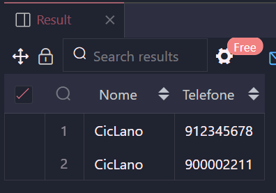

# Relações em SQL - Template de Prática

## Índice

-   [Prática Guiada 1](#prática-guiada-1)

    -   [Enunciado](#enunciado)
    -   [Resolução](#resolução)

-   [Prática Guiada 2](#prática-guiada-2)

    -   [Enunciado](#enunciado-1)
    -   [Resolução](#resoluc3a7c3a3o-1)

-   [Prática Guiada 3](#prática-guiada-3)

    -   [Enunciado](#enunciado-2)
    -   [Resolução](#resoluc3a7c3a3o-2)

-   [Fixação](#fixação)

    -   [Enunciado](#enunciado-3)
    -   [Resolução](#resoluc3a7c3a3o-3)
    -   [Extra](#extra)

## Prática Guiada 1

### Enunciado


### Resolução

```sql
-- Active: 1696280218730@@127.0.0.1@3306

-- Práticas

-- PRÁTICA 1:

-- Criando as tabelas:

CREATE TABLE
    licenses (
        id TEXT PRIMARY KEY UNIQUE NOT NULL,
        register_number TEXT UNIQUE NOT NULL,
        category TEXT NOT NULL
    );

CREATE TABLE
    drivers (
        id TEXT PRIMARY KEY UNIQUE NOT NULL,
        name TEXT NOT NULL,
        email TEXT UNIQUE NOT NULL,
        passoword TEXT NOT NULL,
        license_id TEXT UNIQUE NOT NULL,
        FOREIGN KEY (license_id) REFERENCES licenses(id)
    );

-- Verificando a criação:

SELECT * FROM licenses;

SELECT * FROM drivers;

-- Populando:

-- Precisa popular primeiro a tabela que ira ser referenciada! A que possui a PK

INSERT INTO licenses
VALUES ('L001', '11111111', 'B'), ('L002', '22222222', 'A'), ('L003', '33333333', 'AB');

INSERT INTO drivers
VALUES (
        'D001',
        'Fulano',
        'fulano@email.com',
        '1234',
        'L002'
    ), (
        'D002',
        'Ciclano',
        'ciclano@email.com',
        '4567',
        'L001'
    ), (
        'D003',
        'Beltrano',
        'beltrano@email.com',
        '8975',
        'L003'
    );

-- Visualizando

SELECT * FROM drivers;

-- VISUALIZANDO TUDO

SELECT * FROM licenses INNER JOIN drivers;

-- Mostre as colunas em que onde a PK é igual à FK:

SELECT *
FROM licenses
    INNER JOIN drivers ON drivers.license_id = licenses.id;

SELECT
    drivers.name AS Nome,
    licenses.register_number AS Licensa,
    licenses.category AS Categoria
FROM licenses
    INNER JOIN drivers ON drivers.license_id = licenses.id;
```

## Prática Guiada 2

### Enunciado


### Resolução

```sql
-- PRÁTICA 2:
-- users é 1
-- phones é muitos
-- Relação: De um para muitos
```

## Prática Guiada 3

### Enunciado


### Resolução

```sql
-- PRÁTICA 3:

CREATE TABLE
    users(
        id TEXT PRIMARY KEY UNIQUE NOT NULL,
        name TEXT NOT NULL,
        email TEXT UNIQUE NOT NULL,
        password TEXT NOT NULL
    );

CREATE TABLE
    phones(
        id TEXT PRIMARY KEY UNIQUE NOT NULL,
        phone_number TEXT UNIQUE NOT NULL,
        user_id TEXT NOT NULL,
        -- não poder ser UNIQUE porque é 1:M
        FOREIGN KEY (user_id) REFERENCES users(id)
    );

INSERT INTO users
VALUES (
        '001',
        'Fulano',
        'fulano@email.com',
        '1234'
    ), (
        '002',
        'CicLano',
        'CicLano@email.com',
        '5678'
    );

INSERT INTO users
VALUES (
        '003',
        'Beltrano',
        'beltrano@email.com',
        '8422'
    );

SELECT * FROM users;

DROP TABLE phone;

INSERT INTO phones
VALUES ('p001', '912345678', '002'), ('p002', '900002211', '002'), ('p003', '911110041', '001');

SELECT * FROM phones;

SELECT * FROM users INNER JOIN phones ON users.id = phones.user_id;

SELECT
    phones.phone_number AS Telefone,
    users.name AS Nome
FROM phones
    INNER JOIN users on user_id = users.id;
```

Ter atenção ao deletar dados da tabela (DELETE) ou a tabela em si(DROP TABLE)

```sql
-- ATENÇÃO AO DELETE!
-- DELETAR PRIMEIRO A TABELA DE FK! E DEPOOOIS A DE PK!
-- NESSE CASO: PRIMEIRO A TABELA phones e depois a users

DELETE FROM phones;

DELETE FROM users;
```

REFINANDO A BUSCA

```sql
-- SE EU QUISER MOSTRA OS DADOS DO CICLANO:

SELECT
    users.name AS Nome,
    phones.phone_number AS Telefone
FROM users
    INNER JOIN phones ON users.id = phones.user_id
WHERE users.name LIKE 'Ci%';
```



## Fixação

### Enunciado


### Resolução

```sql
-- EXERCÍCIO EXTRA:

-- => 1:m
-- Uma marca pode ter vários produtos, mas um produto só pode ter uma marca

-- Criando a tabela de referência:

CREATE TABLE
    brand (
        id TEXT PRIMARY KEY UNIQUE NOT NULL,
        name TEXT NOT NULL
    );

-- Visualizando:

SELECT * FROM brand;

-- Populando:

INSERT INTO brand
VALUES ('b001', 'Fofura Baby'), ('b002', 'Gótica Trevosa')

-- Criando a tabela que irá referenciar:

CREATE TABLE
    products (
        idProduct TEXT PRIMARY KEY UNIQUE NOT NULL,
        price NUMBER NOT NULL,
        description TEXT NOT NULL,
        idBrand TEXT NOT NULL,
        FOREIGN KEY (idBrand) REFERENCES brand(id)
    );

-- Visualizando:

SELECT * FROM products;

-- Populando:

INSERT INTO products
VALUES ('p001', 12.3, 'Berço', 'b001'), ('p002', 45.6, 'Vestido', 'b002'), ('p003', 45.6, 'Meia', 'b001');

-- Visualização com JOIN:

-- Mostrando os usuários que possuem a coluna _idBrand_ com o mesmo id de _clients.id_ :

SELECT
    brand.name AS Nome,
    description AS Descrição
FROM brand
    INNER JOIN products on idBrand = brand.id;

-- Filtrandoo pelos nome que começam com F:

SELECT
    brand.name AS Nome,
    description AS Descrição
FROM brand
    INNER JOIN products ON idBrand = brand.id
WHERE brand.name LIKE 'F%';

-- Filtrandoo pelos nome que começam com Gótica:

SELECT
    brand.name AS Nome,
    description AS Descrição
FROM brand
    INNER JOIN products ON idBrand = brand.id
WHERE brand.name LIKE 'Gótica%';

-- Filtrandoo pelos nome que começam com Fofura:

SELECT
    brand.name AS Nome,
    description AS Descrição
FROM brand
    INNER JOIN products ON idBrand = brand.id
WHERE brand.name LIKE 'Fofura%';

-- Deletando:

DROP TABLE products;

DROP TABLE brand;
```
